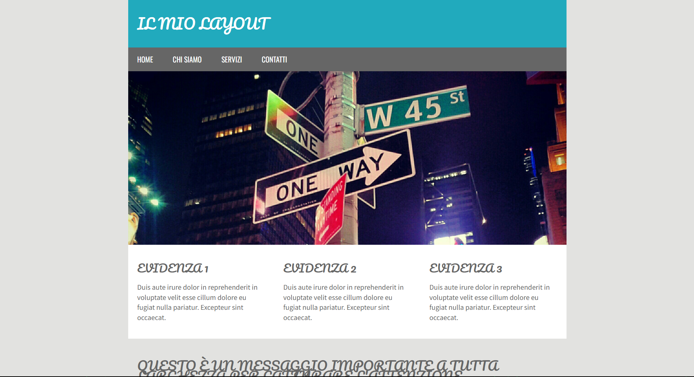
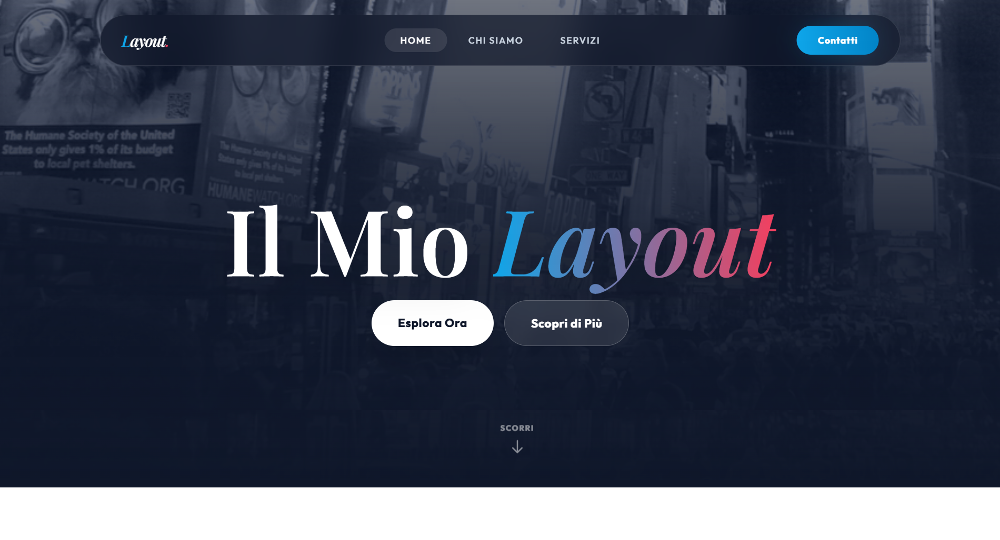

# Restyling Sito Moderno

Benvenuto nel progetto di restyling per l'Esercizio 3. Questo progetto illustra l'evoluzione da un layout in puro HTML/CSS tradizionale, rigido ad elementi standardizzati e datati (presente in `01-original-html`) verso un layout dal design *ultra-moderno*, layout *full-width* ed un impianto nativamente **responsivo** (presente in `03-sito-moderno`).

## 🌍 Anteprima Live

Puoi visualizzare il progetto completato e funzionante direttamente a questo link:
**[https://davi06s.github.io/Sito-Moderno/](https://davi06s.github.io/Sito-Moderno/)**

## 🎨 Design su Figma

Il layout e la prototipazione grafica originale del progetto sono consultabili pubblicamente su Figma:
**[Guarda il Progetto Figma](https://www.figma.com/design/wMxG2mS4bmg1ugx4sI9CIj/Full-Stack-Exercise?node-id=0-1&t=MtuEqirknpfZzmiT-1)**

## 📸 Confronto: Prima e Dopo

Di seguito puoi osservare il salto di qualità tra la versione originale e il restyling moderno:

### Prima (Layout Originale)

### Dopo (Layout Modernizzato)

Il design modernizzato è stato interamente realizzato ponendo il focus sulle tecniche e le interfacce user experience front-end odierne, basandosi sul vasto motore e styling di **Tailwind CSS**.

## 📂 Struttura del Progetto

Il workspace e le radici del tree directory principale si snodano sulle seguenti cartelle:

- **`01-original-html/`**: Rappresenta la baseline di partenza. Contiene lo scheletro in HTML della lezione precedente di partenza, un layout a larghezza prestabilita tramite file CSS custom isolati e l'integrazione base del *Nivo Slider* appoggiato su una versione storica di jQuery (`1.7.1`).
- **`02-figma/`**: Raccoglie assets o riferimenti per eventuali prototipazioni o conversioni per design tool, di base un supporto ai developer sul fine ultimo.
- **`03-sito-moderno/`**: Contiene la landing page completamente riscritta. Sfrutta il motore delle utility classes Tailwind CSS preconfigurato per garantire: un layout componentizzato fluidamente, una paletta ed estesa scelta per gradient color, micro-animazioni ai pulsanti interattivi e il noto effetto di sfocatura (*Glassmorphism*).

## 🚀 Come Avviare o Visualizzare il Progetto

Il progetto base si fonda sui canoni statici, i tool JS a CDN e standard per visualizzazione lato client. L'applicazione non necessita dunque di complesse toolchain (React/Vite).
Per visualizzare in locale il lavoro moderno ultimato:

1. Naviga all'interno della cartella directory `/03-sito-moderno/`.
2. Fai doppio clic/apri direttamente nel tuo editor o gestore directory il file root `index.html`.
3. Esso si avvierà nel browser predefinito di sistema (es. Chrome, Firefox, Egde) funzionando nel pieno della sua architettura.

## 🛠 Tecnologie Impegnate

Oltre all'utilizzo profuso di basi teoriche per una corretta accessibilità (ARIA attributes parziali, semantics label) sono state impiegate massicciamente le sequenti tecnologie:

- **HTML5**: Formattazione solida del markup del sito.
- **Tailwind CSS**: Precaricato *on the fly* ai fini valutativi/didattici tramite il suo script in ambiente CDN (Content Delivery Network). Consente una estensione del CSS "utility-first" garantendo una profonda responsività senza appesantire il parsing con l'eccesso di macro classi e fogli esterni custom da importare.
- **JavaScript & jQuery 1.7.x**: Per dimostrare l'integrazione modulare, sono state preservate le integrazioni legacy di file e chiamate jQuery per garantire le piene operatività, sebbene retrocompatibili, del plugin rotativo *Nivo Slider*. Esso è stato semplicemente sovrascritto nella visualizzazione da un overlay in tailwind e nel box-shadow senza alterarne la chiamata.
- **Google Web Fonts**: La tipografia ruota sul connubio ben equilibrato tra il font primario sans-serif (*Outfit*), pulito su paragrafi, unito al contrasto d'impatto forte dei titoli per mezzo di una versione serif d'editoria (*Playfair Display*).

---
